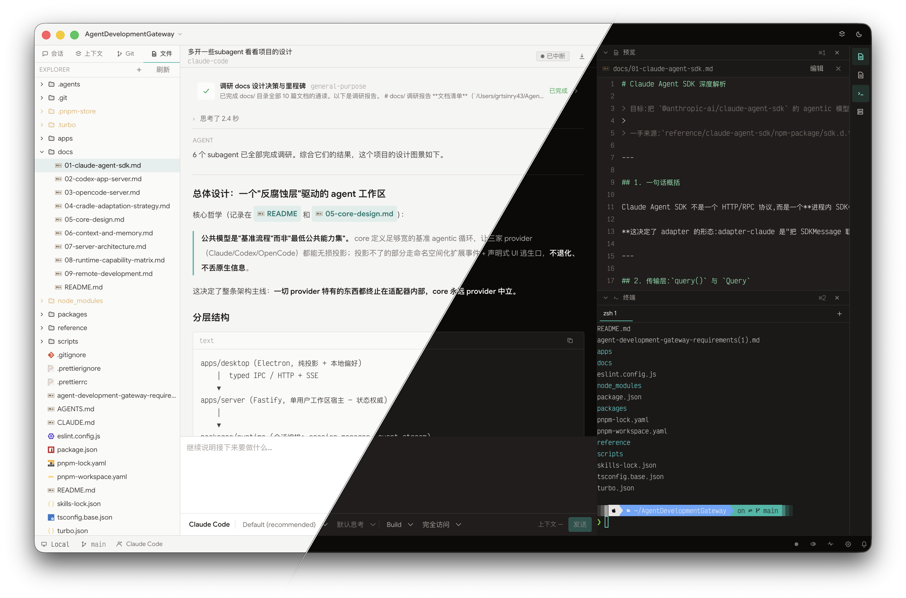

# Agent Development Gateway

> **连接开发者、IDE、开发主机、长期上下文与多种 Coding Agent Runtime 的本地优先开发工作台。**
>
> 不替代 JetBrains / VS Code,也不只是 Claude Code 的 GUI 外壳 —— 它把本地与远程开发主机、
> 多种 Coding Agent Runtime(Claude / Codex / OpenCode)、Agent 会话、项目上下文与端口转发
> 统一到一个 IDE 式的工作区里,保留 TUI 的密度与直接,换来 GUI 的稳定、可恢复与可管理。

> ⚠️ **当前处于开发中(alpha)。** 功能边界与用法可能随迭代变化。

<!-- 头图:screenshots/hero.png。由 light.png(左上浅色) + dark.png(右下深色)
     斜切拼合,分割线过图像中心、与正半轴夹角 60°。 -->
<p align="center">
	
</p>

---

## 产品介绍

**Agent Development Gateway** 想解决的问题:不同的 Coding Agent Runtime(Claude Agent SDK、
Codex app-server、OpenCode server)各有各的协议、交互模型和工具形态。与其在每个 runtime
里各写一套前端,不如抽象出一个**统一 Runtime 模型**,让同一个 IDE 式工作区去驱动它们。

- **IDE 布局,不是聊天窗口。** 每个工程一个 Project 窗口:左侧 Sessions / Context / Git / Files,
  中央对话与工具调用时间线,右侧可拆分的工具面板(任务、变更、预览、终端、端口、远程日志),
  底部状态与快捷键提示。键盘优先、信息密集。
- **工程即入口。** Launcher 管理最近工程与远程主机;`path @host` 唯一标识一个工程,本地与
  SSH 远程工程共用一套工作区。
- **一次会话,三种 Agent。** 基于 `@agent-gateway/core` 的通用 Agentic 循环模型,Claude /
  Codex / OpenCode 各自有独立 adapter,能力按 capability 门控,不按 provider 名分支。
- **本地与远程同一个工作区。** `apps/server` 是单用户 Workspace Host(工程/会话/文件/Git/终端),
  可跑在本机,也可经 SSH 部署到开发机;桌面端通过 SSH 本地转发访问远程 server,远程日志、
  端口转发、文件预览都按远程语义工作。

## 核心特性

**统一会话时间线**
- 创建/切换 Claude、Codex、OpenCode 会话;流式文本、思考、工具调用、变更集(ChangeSet)、
  子代理、任务(todo)、交互审批统一投影到一条时间线,可恢复、可导出。

**工程工作区(IDE 式布局)**
- Launcher 入口 + 每工程一个窗口;左侧 Sessions / Context / Git / Files,中央会话,
  右侧可拆分的工具面板(任务、变更、预览、终端、端口、远程日志)。
- 文件树(创建/重命名/删除/移动、复制剪切粘贴、拖拽、双击预览、远程下载到本地)、Git 与多终端。

**变更与预览**
- "变更"面板把本会话对所有文件的修改按文件聚合,逐次查看每次 diff。
- "端口"面板:Agent 预览自动建立转发,也可手动绑定远端端口;Web 预览以受控 `<webview>` 嵌入。

**远程开发**
- SSH 主机管理(safeStorage 保存密码)、ControlMaster 免密复用、一键部署远端 Server、
  SSH 本地转发、远程日志串流、标题栏主机状态 —— 本地与远程同一套工作区。

**设计系统与键位**
- 统一 token 化样式、全局 scoped keymap、全键盘可达的密集界面。

规划中的能力:长期 Memory、Skills / MCP / Plugins 管理、JetBrains IDE Bridge、Remote Control
(Web / 移动端)、TUI Client 与 Plugin SDK。

## 架构

```
┌─────────────────────────┐      ┌──────────────────────────┐
│  apps/desktop (Electron) │  IPC │   apps/server (Fastify)   │
│  Launcher + Project 窗口 │◄────►│  Workspace Host           │
│  渲染: Svelte 5           │  ws  │  工程/会话/文件/Git/终端   │
└───────────┬─────────────┘      └──────────┬───────────────┘
            │  @agent-gateway/core           │
            ▼                              ▼
   packages/runtime ──► adapters: Claude / Codex / OpenCode
```

- `apps/desktop`:Electron 桌面端(Launcher 与 Project 多窗口、typed IPC、远程连接胶水)。
- `apps/server`:Fastify 单用户 Workspace Host,本地内嵌或远程部署。
- `packages/core`:provider 无关的统一 Runtime 模型与 adapter/传输契约。
- `packages/adapter-*`:各 provider 集成(协议、流式、交互、工具归一化)。
- `packages/runtime`:会话/事件编排(runtime 层)。
- `packages/shared`:桌面↔服务端共享的运行时值与类型契约。

## 快速开始

要求:Node.js 22.12+、pnpm 11.13。

```sh
pnpm install
pnpm dev            # 启动 Turborepo 开发图(桌面 + server)
```

常用命令:

```sh
pnpm dev --filter=@agent-gateway/server
pnpm dev --filter=@agent-gateway/desktop
pnpm lint
pnpm typecheck
pnpm build
```

本地 server 默认监听 `http://127.0.0.1:3000`(`GET /health` 为健康检查),可用 `PORT` 更改。
桌面端 dev 模式由主进程拉起本地 server(`PORT=0`,读 stdout 哨兵);打包时可内嵌 server 产物。

## 文档

设计决策与 provider 调研见 [`docs/`](./docs/README.md);`reference/` 为只读参考工程。
